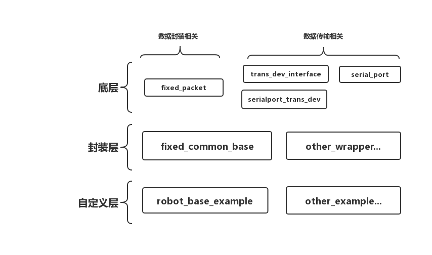

# robot_base模块

## 1.简介

robot_base是RoboMasterOS 中的一个基础功能包，提供了与机器人底层STM32通信的相关功能，是计算机与机器人之间的数据桥梁，实现了数据收发功能。

* 通过robot_base给机器人底层STM32发生控制数据，来控制机器人行动，
* 接收机器人的底层STM32的数据，并发布成ROS topic，供程序使用。

同时，还支持二次开发，其中的数据包封装模块，串口驱动模块等模块，可以直接使用，开发自己的机器人通信模块，加速开发。

## 2.文件说明

主要文件：

|            文件            |                      功能描述                      |
| :------------------------: | :------------------------------------------------: |
|   trans_dev_interface.h    |              定义通用数据传输设备接口              |
|     serial_port.h/cpp      |                  串口设备通用驱动                  |
| serialport_trans_dev.h/cpp |   串口传输设备（实现了trans_dev_interface接口）    |
|     fixed_packet.h/cpp     | 固定长度数据包，封装了数据拆包，解包，校验等功能。 |
|  fixed_common_base.h/cpp   |         固定数据包收发模块基类，基本封装类         |

exampe文件：(提供了一个开发样例)

|                 文件                 |       功能描述        |
| :----------------------------------: | :-------------------: |
|          protocol_example.h          |  通信协议命令宏定义   |
|        robot_base_example.cpp        | 机器人通信ROS顶层封装 |
| （nodes目录下）example_base_node.cpp | 创建机器人通信ROS节点 |

## 3.快速使用

提供了一个开发样例，可以快速验证，同时也为二次开发提供了参考。

__样例协议：__

* [protocol_example](doc/protocol_example .md)

__修改配置文件：__

需要准备一个usb串口模块

__运行节点：__

```bash 
rosrun robot_base example_base_node
```

__测试节点：__

```bash
rosrun robot_base example_gimbal_control_test.py
```

* example_gimbal_control_test发布云台控制信息的ROS topic
* example_base_node接收到云台控制信的ROS topic，并根据协议封装数据包，使用串口发送给底层。

## 4.二次开发

### a.robot_base结构图：



* 数据封装：目前只支持定长数据包，即fixed_packet，未来考虑增加不定长数据包的支持
* 数据传输：使用接口设计，实现多传输设备支持，目前只实现了串口设备的数据传输。
* fixed_common_base：基于fixed_packet，对数据收发进行了封装，可通过继承该类实现数据包的收发，屏蔽trans_dev相关操作。
* robot_base_example继承了fixed_common_base，可直接调用其接收数据包（fixed_packet），发送数据包接口，只需要关心将相应ROS topic打包即可。

### b.trans dev模块

采用了接口设计，实现了数据传输的设备的通用性，以及可替换性。

__trans_dev_interface接口：__

以下三个接口函数必须实现，包括设备打开查询，数据结束和数据发送。

```c++
virtual bool isOpen()=0;
//return recv len>0,return <0 if error 
virtual int dataRecv(unsigned char *recv_buf,int data_len)=0;
//return send len>0,return <0 if error 
virtual int dataSend(unsigned char *send_buf,int data_len)=0;
```

__串口设备:__

* serial_port.h/cpp为linux通用的串口通信实现，可以实现数据收发。
* serialport_trans_dev.h/cpp是对serial_port的封装，实现了trans_dev_interface接口。

### c.fixed packet模块

* fixed_packet.h/cpp：数据包封装，详细使用参考文档[fixed_packet.md](doc/fixed_packet.md)

### d.自定义通信节点

* 详见[robot_base_exmaple.md](doc/robot_base_exmaple.md).

### 5.维护者及开源许可证

- gezp 1350824033@qq.com

robot_cam provided under GPL-v3.
