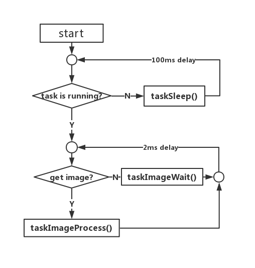

# task_image_related模块

## 1.简介

task_image_related是RoboMasterOS 中的一个基础功能包，为用户开发图像处理相关的任务提供相关支持，加快开发速度。主要实现了以下几个功能：

* 提供一些图像调试工具（如在图像上绘制四边形，显示图片，调试开关等）
* 提供一些图像处理工具（如基于单目视觉的3D位置算工具等）
* 图像任务封装，使得用户不需要考虑ROS图像订阅等步骤，只需要关心图像处理即可。

## 2.文件说明

主要文件：

|             文件              |                         功能描述                          |
| :---------------------------: | :-------------------------------------------------------: |
|         image_tool.h          |               工具类，提供一些图像调试工具                |
|    mono_measure_tool.h/cpp    | 工具类，一些单目算法封装（包含PNP解算，相似三角形投影等） |
| task_image_related_base.h/cpp |        图像任务基类，封装了ROS图像订阅等相关操作。        |

example：（使用例子）

|               文件                |                      功能描述                      |
| :-------------------------------: | :------------------------------------------------: |
|       task_show_image.h/cpp       | 开发样例，基于task_image_related，实现显示图片任务 |
| task_show_image_node.cpp（nodes） |           ROS节点，运行task_show_image。           |

## 3.快速使用

该模块提供了一个样例，可以直接运行

* 需要运行了相机模块，或者其他模块发布ROS图片

__修改配置文件__（res/task_show_image_config.yaml）

```yaml
#cam topic name
cam_topic_name : "/front_camera/image_raw"
```

* cam_topic_name：图片ROS topic名字

> 可通过 rostopic list命令查看所有topic名字。

__运行__

```bash
rosrun task_image_related task_show_image_node
```

* 运行成功，即可打开一个窗口，实时显示图片

## 4.二次开发

### a.task_image_related_base模块使用

task_image_related_base封装了图像处理任务相关操作，只需要实现以下几个接口

```c++
//（可选）初始化入口，相关自定义的初始化操作在该函数实现
int initTask(std::string conf_path);
//必须实现接口，图像处理入口，第一个参数为待处理的图像，第二个参数为对应图像的时间戳(ROS时钟)
void taskImageProcess(cv::Mat& img,double img_stamp);
//（可选）图像等待时候的调用函数
void taskImageWait();
//（可选）任务休眠时候的调用函数。
void taskSleep();
```

task_image_related_base模块运行流程图：



* 在任务休眠和图片获取查询中，增加了延迟，减小空闲期的cpu消耗。
* 采用了多线程，该部分运行在一个单独线程中。

__task_image_related_baseAPI__:主要有以下几个API

子类继承使用API：可在子类中调用来控制任务

```c++
//控制任务是否休眠
void setRunFlag(bool flag);
//检测是否初始化
bool isInitOK();
```

初始必须使用的API:

```c++
//初始化函数，会调用initTask()函数，子类初始化应该使用init()函数
int init(std::string conf_path);
```

__样例开发：__

* 参考文档[example.md](doc/example.md)

### b.ImageTool模块使用

工具类，主要包括两部分，图像调试和图像数学计算

* 详见文档[image_tool.md](doc/image_tool.md)

### c.MonoMeasureTool模块使用

工具类，主要包括基于PNP，和相似三角形投影算法的单目3d点位置解算。

* 详见文档[mono_measure_tool.md](doc/mono_measure_tool.md)

## 5.维护者及开源许可证

- gezp 1350824033@qq.com

robot_cam provided under GPL-v3.